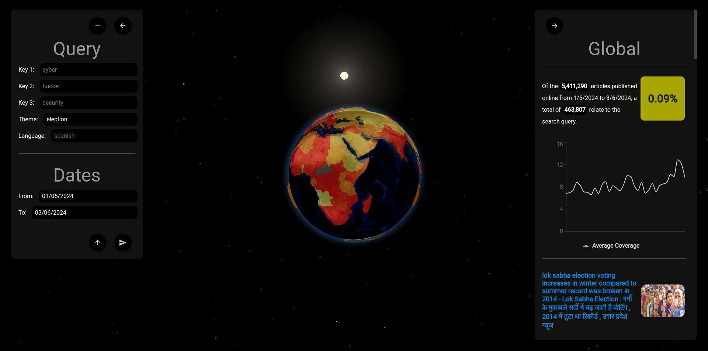

# NavNews
NavNews is React application designed to improve how people interact with global news. 
By presenting a dynamic, interactive scene of planet Earth, NavNews allows 
users to navigate, explore, and compare the world's news landscape through different themes, queries, and languages.

In today's fast-paced digital age, global news is moving ever-fast. 
Trends are difficult to identify, and the social media algorithms do all too well in
trapping us in echo chambers. 
This obscures the bigger picture. 
NavNews aims to counteract this by providing a view of the major 
ideas and themes dominating the news across different regions and time periods.

With NavNews, users can:
- **Explore Global News Trends:** See which themes are currently dominating the news across various regions.
- **Understand Regional Focuses:** Discover what different parts of the world are focusing on in their news coverage.
- **Track Trends Over Time:** Look back at past trends and understand how news themes have evolved over time.

NavNews has a goal that can never be fully met.
The project is currently on hold.
If any ideas of new features come to mind feel free to make a suggestion.

## The Scene

The interactive scene in NavNews is built with [react-three-fiber](https://github.com/pmndrs/react-three-fiber).
All attention is on the interactive representation of the globe.

1. **Planet Earth:**
   - The globe is divided into countries using GeoJSON data, allowing users to filter and compare news by country.
   - The Earth's surface is textured with [Blue Marble](https://www.visibleearth.nasa.gov/collection/1484/blue-marble) maps
   - Enhancements through bump maps, reflectivity, and opacity yield a more rough and realistic asset.

2. **The solar system:**
   - The scene's entirety is the Earth, Sun, and sparrkling stars.
   - The Earth's position, rotation, and axis is approximated using the the time of day and time of year.
   Seasonal changes can also be seen on the texture of the Earth with the coming and goings of winter.
   - Custom shaders written in GLSL are used throughout to soften and immersify the scene.rsive.
 
The scene of NavNews can easily be described as an overkill.
Consider it a combination of finding joy in the creation process and 
creating meaningful perspective for understanding the news around the world.

## The data

NavNews leverages data from [The GDELT Project](https://www.gdeltproject.org/), 
an ambitious, comprehensive global monitoring system that tracks and codifies news from around the world. 
By utilizing the [GDELT Doc API](https://blog.gdeltproject.org/gdelt-doc-2-0-api-debuts/), 
NavNews can showcase articles published across the globe froma dataset that updates every 15 minutes
by using some simple pipelining and processing. 

The GDELT project, most unfortunately, does not specify its limitations in terms of the exact
languages and locations it covers. 
As a result, the comparisons and articles you find in NavNews are imperfect.
Certain topics and regions might will be underrepresented.
Despite these limitations, GDELT provides a robust platform for exploring and understanding global news trends.

## The use

NavNews provides an intuitive interface for querying and exploring the extensive dataset sourced from the GDELT Project.
Users can interact with the app to discover global news trends and compare how different regions report on various topics.

#### Querying

Users can query the database of articles using several parameters:
- **Keys:** exact matches in the titles and text of articles.
- **Theme:** GDELT themes, which are determined through natural language processing.
- **Language:** in which the articles were published.
- **Source country:** where the article was published.
- **Dates:** interval of publication dates.

#### Analysing

The query results provide a comprehensive overview, including:
- **Article count:** the number of articles relevant to the search query, compared to the world and the total number of articles published.
- **Graphical coverage:** a graph illustrating the coverage of news related to the search, showing trends over time. Depending on the search, this
trend line is compared to the coverage of the world.
- **Relevant articles:** a list of the most relevant articles, allowing users to delve deeper into specific news stories and verify the search results.

#### Applications

With these features, users can:
- **Discover relevant news:** find important news stories from around the world, tailored to specific interests and criteria.
- **Review country-specific news:** examine the news coverage of a specific country, gaining insights into local perspectives and reporting.
- **Compare global coverage:** see how different countries cover related news topics, 
both in the search results and on the interactive globe where regional differences are highlighted.

NavNews offers a powerful starter tool to look into news coverage trends.
It cannot yet replace a news app as it does not push any specific topics... maybe for the future. 
It can assist in the understanding of regional news focuses, and explore the interconnectedness of worldwide news coverage.

